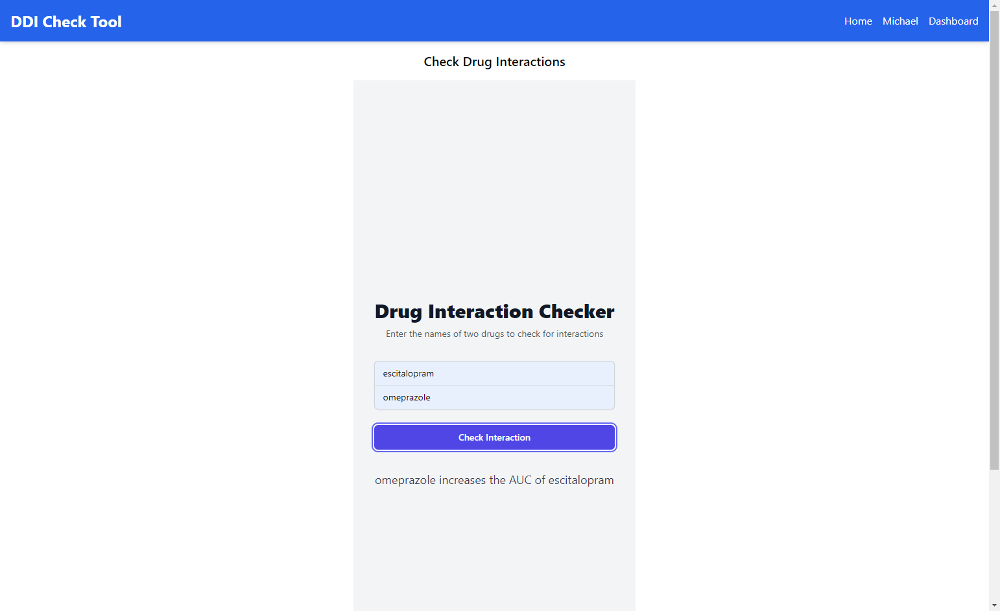
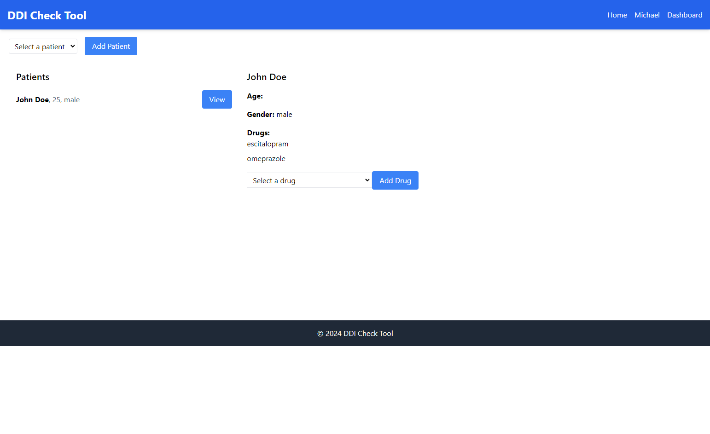

## README

### Getting Started

This project consists of a backend built with Node.js and Express, and a frontend built with React. Follow the instructions below to set up and run both parts of the application.

### Prerequisites

- Node.js
- npm
- MongoDB

### Backend Setup

1. **Create a MongoDB database:**
   - Set up a MongoDB database and note the connection URL.

2. **Set the connection URL in `server.js`:**
   - Open `server.js` located in the backend folder (`./ddi-checker-node/src`).
   - Replace the connection URL with your MongoDB database URL. For example:
     ```javascript
     mongoose.connect('mongodb://localhost:27017/ddi-checker', {
       useNewUrlParser: true,
       useUnifiedTopology: true,
     });
     ```

3. **Install backend dependencies:**
   - Navigate to the backend folder:
     ```bash
     cd ./ddi-checker-node/src
     ```
   - Install dependencies:
     ```bash
     npm install
     ```

4. **Start the backend server:**
   - Run the server:
     ```bash
     node server.js
     ```

### Frontend Setup

1. **Navigate to the frontend folder:**
   ```bash
   cd ./ddi-checker-react
   ```

2. **Install frontend dependencies:**
   ```bash
   npm install
   ```

3. **Start the frontend server:**
   ```bash
   npm start
   ```

### User Guide

1. **Create a new user (patient or physician):**

   

2. **Login with an existing user:**

   

3. **Check interaction between two drugs:**

   

4. **Physicians have a dashboard with their patients:**

   

### Note

- Ensure both the backend and frontend servers are running simultaneously.
- The backend server should run on `http://localhost:3100` and the frontend server should run on `http://localhost:3000`.

### Troubleshooting

- If you encounter any issues with CORS, ensure that the backend server has the appropriate headers set to allow requests from the frontend.
- Check the console for any error messages and resolve them accordingly.

Enjoy using the DDI Check Tool!